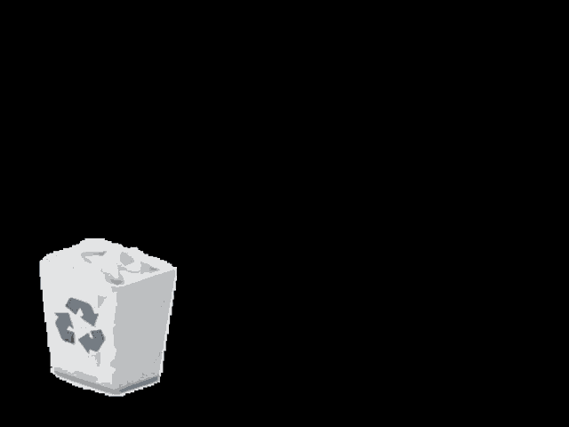

# [Siege-O-Namics](https://dalmontron05.github.io/Siege-O-Namics/)
**It's Like Wikipedia, but for *Rainbow Six: Siege* Operators.**    

Ubislop's official website is... well, it's slop. Tom Clancy's Rainbow Six: Siege is a bad game with a steep learning curve. As someone who's played for years with 2500 hours in the game, I can't in good faith reccomend it to someone.  

That being said, R6 is a one of a kind. I (for the most part) love the game and continue to play it consistantly to this day. This project will help if you're a beginner, but it's catered more towards intermediate players that want to take the next step in their competitive gameplay.

Did you know anyone in Tubarão's gadget doesn't glow yellow in glaz's thermal scope? Have you seen that Thermite can breach a wall that's electrified by breaching a perpendicular wall or the floor above? Were you aware of how shockingly easy it is to EMP a C4 with Thatcher's gadget?

Mastering these situational, yet important scenarios are what seperate the great from the good. Knowing the full potential of what operators you main can do is a low investment, high reward method of drastically improving your skill and fun within siege.

<!-- add an r6 logo tab icon -->